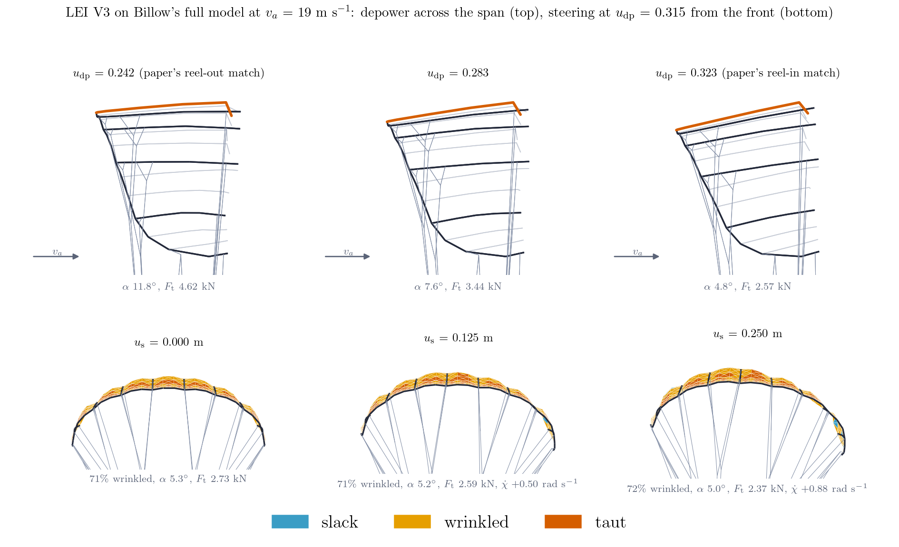

# Coupling Billow

Billow is a structural solver. It has no opinion about where its loads come
from, and deliberately no way of finding out: the package imports only NumPy and
CasADi.

Coupling it to a flow solver therefore belongs in an **adapter on the other side
of that boundary** — a module that knows both your file format and Billow's
element vocabulary, and that nothing inside Billow imports. The reference
adapter is [AWETrim](https://github.com/awegroup/AWETrim)'s `aerostructural/`
package, which drives Billow against a vortex-step-method quasi-steady trim.

## The shape of a staggered loop

```
        loads
  flow  ----->  Billow.solve(forces)  ----->  shape
    ^                                            |
    |____________________________________________|
                    relaxation
```

1. map the structural nodes onto the aerodynamic geometry;
2. solve the flow on that geometry;
3. map the resulting load field onto structural nodes;
4. `solve` for the new shape;
5. relax the node displacement (Aitken works well) and repeat until the nodal
   forces stop moving.

Billow's part is step 4 and nothing else.

## What an adapter has to get right

These are the things that turned out to matter when building the reference one.
None is a Billow API question; all of them will bite any adapter.

### Warm start, and let the state persist

`MinimumEnergySolver` compiles once and every numeric input is a parameter, so a
coupled loop should build one solver and reuse it for every iteration. For a
line system, [`LineSystem`](api/wireframe.md) already carries the state across
`solve` calls.

Resetting to the built geometry each iteration throws away the only good initial
guess you have.

### `solve` is one step when a move limit is active

With `move_limit` set, each `solve` is one trust-region step, and **IPOPT
reporting success does not imply equilibrium** — it succeeded on the *boxed*
problem while sitting on the boundary. Walk `solve` until the force residual is
met, and terminate on the residual.

### A load path the structure does not have

!!! danger "A gravity-only load case is not a smoke test"
    Pin a kite at its bridle point and apply gravity alone: every bridle line
    goes slack and the knots become a mechanism. The residual sits at exactly
    their weight, and no solver setting moves it.

    Billow reports that faithfully. Codes that regularise with an absolute
    identity stiffness hide it, because that acts as a ground spring on every
    node. Load the structure the way the flow does.

### Rest lengths as authored may not be in equilibrium

Measured rest lengths and measured node positions usually disagree, and at a
real `EA/l0` a small disagreement is an enormous pre-stress. On the reference
kite one line was 11.5% long, worth **88 kN**.

Relax the line system before building the reference configurations of anything
else, so the beams and fabric take their reference state on the shape the model
actually starts from.

!!! note "Relaxation cannot fix a line that is too long, only one that is too short"
    It moves nodes, and no node motion takes up slack that the taut lines have
    already pinned. What survives the relaxation is the real inconsistency in
    the geometry — which is useful information, so read it rather than tuning it
    away.

### Frames are transported, not seeded per member

See [Element library](elements.md#geometrically-exact-timoshenko-beam) and
[Formulation](formulation.md#symmetry). Seeding each chain's roll independently
piles arbitrary roll on top of the physical joint angle, and a
mirror-symmetric structure additionally needs mirror-*consistent* frames, not
transported ones.

### Loads are dead per solve

Which is exactly right for a staggered loop, and exactly wrong for anything that
tries to fold the flow into the same minimisation — a follower pressure is not
conservative and has no potential.

## What a coupled sweep looks like

The reference adapter drives Billow's full model — inflatable tube beams and a
wrinkling membrane canopy on the bridle's line system — through the actuation
sweeps a kite is designed around: the depower tape, which pitches the wing about
its bridle point, and the steering tapes, which shorten one side and lengthen the
other.



*TU Delft LEI V3 at the centre of the wind window, one converged coupled state
per panel. Top, across the span: the depower tape rotates every rib's chord, and
the trimmed angle of attack falls from 11.8 to 4.8 degrees over the swept range,
with the tether force following it. Bottom, from the front: steering rolls the
wing and turns the trim. Canopy triangles carry the membrane's own regime —
slack, wrinkled, taut — which is a state of the solution, not a post-processing
choice: about 70% of this canopy is in a tension field at every setting.*

Two things in that figure are worth an adapter author's attention. The angle of
attack is not an input — it is where the moment balance lands, so the structure's
stiffness sets it, and a stiffer or softer bridle moves the whole force curve.
And the wrinkled fraction barely moves across the sweep: wrinkling is the
canopy's normal working state here, which is why the relaxed energy is solved
rather than a membrane that has to be kept taut.

## A minimal adapter

```python
import numpy as np
from billow import build_line_system

class BridleAdapter:
    """Drive a line system from whatever load field the flow solver produces."""

    def __init__(self, geometry):
        self.system = build_line_system(
            nodes=geometry.nodes,
            connectivity=geometry.connectivity,
            rest_lengths=geometry.rest_lengths,
            stiffness=geometry.stiffness,
            tension_only=geometry.is_rope,
            pulley_arm_pairs=geometry.pulley_arm_pairs,
            # State the convention: this format stores the rope total on each arm.
            pulley_rest_lengths=[
                geometry.rest_lengths[first] for first, _ in geometry.pulley_arm_pairs
            ],
            fixed_nodes=geometry.fixed_nodes,
        )
        self.system.build_solver(force_tolerance=1e-4, move_limit=0.25)

    def step(self, nodal_forces):
        solution = self.system.solve(nodal_forces)
        return self.system.positions, solution.residual_norm

    def actuate(self, line, rest_length):
        self.system.set_rest_length(line, rest_length)
```

Everything schema-specific — reading the file, deciding which rows are ropes,
pairing the pulley arms — lives in `geometry`, on the adapter's side of the
boundary. Billow never sees it.
